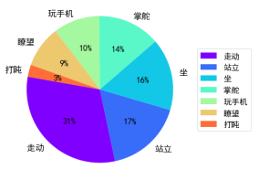

# Intelligent_Early_Warning_System
  

This project provides early warning by analyzing the action of people in the ship's cockpit.

According to statistics of IMO, in the past ten years, most ship accidents were caused by human factors.So we have this idea to ensure the navigation safety by AI techonoly.
Although it is not sound and cannot be used on a commercial environment now,it is an excellent opportunity to explore the usage of computer vision based on Deep CNN.At the same time, it can help me to understand the performance of hundreds Net architectures of different papers.

The code of this projects is dirty now.I may clean the code after I find my graduate mentor.:muscle:	:muscle:	:muscle:	
# Requirements:
PyTorch 1.4 +
torchvision 0.6.0 + 
OpenCV
CUDA >= 9.0

if you want to try remote monitoring
ffmpeg is necessary and an OSS Instance of Cloud Server is required.

# Running
collect_human_pose_label.py is used to collect the action information by Human Pose Estimation Algorithm.
demo.py is used to show person detection,Instance segmentation and Action analyse algorithm of my system.
inference.py is used to fast detection without visualization and send the visual information by TCP/IP or UDP.

# Current Feature
1. Person detection and human instance segmentation.
2. Use Human Pose Estimation Algorithm to generate template actions.
3. Quantify the difference between two actions by visible-L2 which is I proposed to slove the problem of recognition of human actions.
4. Track the movement of people by MaskIOU.
5. Use segmentation technology to capture valuable pixels and reduce the data which is transported by network.
6. Use RLE(run-length encoding) to save person mask image.

# Upcoming Feature
1. Use ML technology to discover the danger of ships by time,boat number,person actions and so on.
2. Use NN pruning technology to accelerate the inference stage.
3. Clean the code and try to give a end-to-end solution.
4. Support more backbone and more model head.  

# EDA 

    
  

# Video Example

    
  
  

  

    
  
  
  

